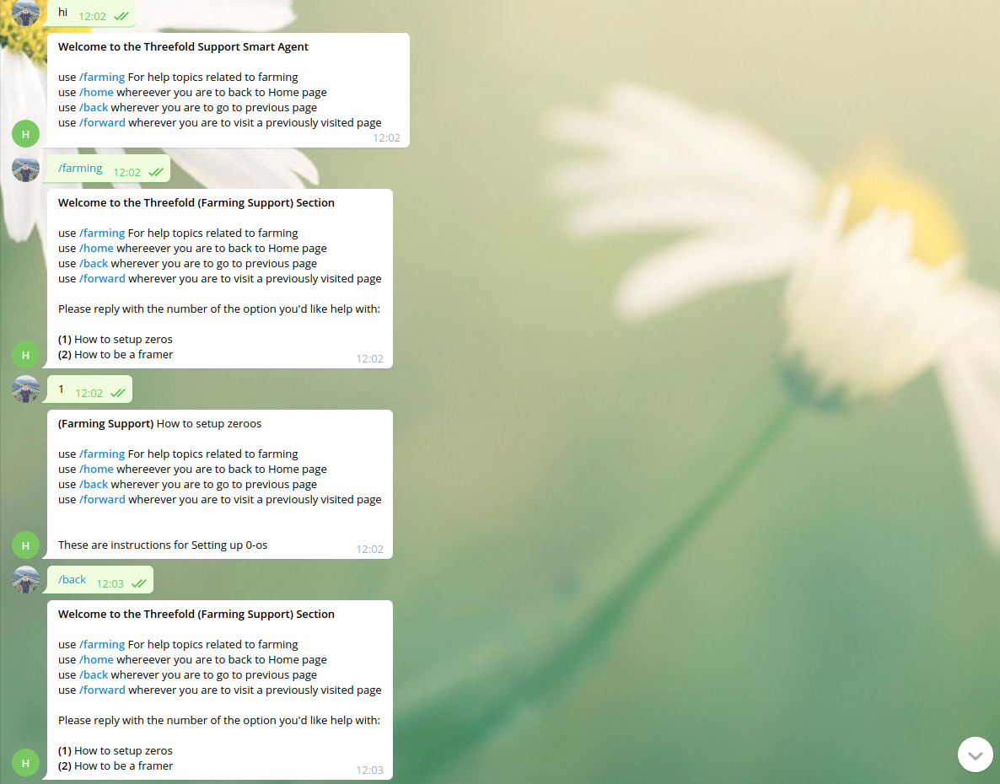
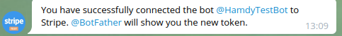

# TF-Telegram-Bot

## Prerequisites

Install vgram

- Using vpm: `v install dariotarantini.vgram`  
- Using vpkg: `vpkg get vgram`

## Quick Getting started
1. run bot server `v  run threefold.v run --token 1836992937:AAEEYXyeQ0klNWJIze1JaAhDtQ1MqeqD9ZM --paymenttoken 284685063:TEST:NzkwMDVhOTUzMjlj`

2. using your telegram, visit `@HamdyTestBot` and interact with as shown



## Getting started

### Create your own bot with payment support

1. Search for the `@botfather` telegram bot and start it  
2. Click on or type `/newbot` to create a new bot and follow his instructions  
3. On finish, `@botfather` will give you a token. Copy that token, it's your bot token will be used in communication with the bot
4. now while talking to `@botfather` type `/mybots` then select your bot

    
5. choose payments

    
6. Choose your payment provider

     
7. I used `Stripe` here but you can use another one
8. conenct to `Stripe testing` for testing or `stripe live` if you need a real account
    
    
9. Authorize

    

10. Now you gonna be redirected to website. Click on `Skip this form` if you are in testing mode

    
11. Now you are redirected back to the (payment provider) bot `stripe` in this case with a success message

    
12. Now you can see your payment token in `@botfather`

    

## Run
- compile `v threefold.v`
- Give execution permissions: `chmod u+x threefold`
- Run (use your tokens) `./threefold --token 1836992937:AAEEYXyeQ0klNWJIze1JaAhDtQ1MqeqD9ZM --paymenttoken 284685063:TEST:NzkwMDVhOTUzMjlj`
- The tokens above belong to `@HamdyTestBot` in case you want to test with


## How to set up pages

- use the dir `templates` to put markdown for communicating with users
- `templates` dir and any sub directory must contain `home.md` page
- `templates/home.md` represents the greeting message or your home page this is sent to user when user first says `hi` or `/home`

- All sub directories under `templates` are top level commands `/{dir_name}` for instance if we have `templates/farming` & `templates/cloud` these willh be accessible through `/farming` & `/cloud` respectively provided that each sub directory contains `home.md`

- under each toplevel directrory sub dirs there are named with the choices u ask user to choose 

    ```
    templates
        |_home.md  (home page) or /hi
        |_ farming
            |_ farming.md  /farming
            |_ 1
                |_ home.md  if user chose (1) while in farming
            |
            |_ 2
                |_ home.md  if user chose (2) while in farming
    ```

- we have `/back` and `/forward` to navigate between pages same as in browser
